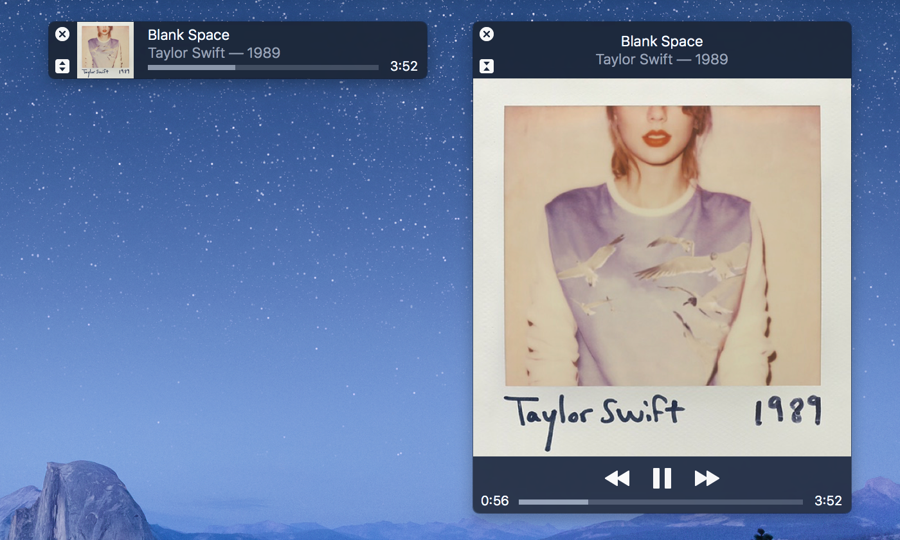

AirBass
=======

AirBass is an AirPlay server implemented in Swift. It enables wireless audio streaming from an iOS device to a Mac using Apple's AirPlay technology.

To get started, connect your iOS device to the same Wi-Fi network as your Mac. Open the Control Center from your iOS device by swiping up from the bottom of your screen. Tap the AirPlay button and select the "AirBass" option. Audio from your device will now begin streaming to your Mac.  

License
-------
This project is available under the Apache 2.0 license. See LICENSE for details.